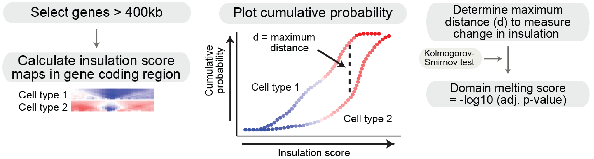

# MELTRON 

_a statistical framework to detect differences in chromatin contact density at genomic regions of interest_

[//]: # [](https://www.biorxiv.org/content/10.1101/2020.04.02.020990v3)




Deposited scripts and files for calculation of [melting scores](https://www.biorxiv.org/content/10.1101/2020.04.02.020990v1) of long genes in oligodendroglia (OLG) from the somatosensory cortex, dopaminergic neurons (DNs) from the midbrain VTA and pyramidal glutamatergic neurons (PGNs) from the hippocampus CA1 relative to embryonic stem cells (ESCs).

### Required packages
```r
library(tidyverse)
library(ggpubr)
```

### Available scripts
- code/MELTRON.R:   
   Compares insulation score (IS) distributions over long genes in OLGs, DNs, PGNs to ESCs and calculates melting score per gene.   
- code/plot_ecdf.R:  
   Plots empirical cumulative density functions (ECDF) for IS values of individual genes.   
- code/plot_rna_atac_over_meltingScore.R:  
   Plots expression and chromatin accessibility as a function of the melting score per cell-type. Density plots with median lines indicate population trends.   

Developed and tested with R version 3.6.0 Planting of a Tree.  
Developend and maintained by Dominik Szabo [](https://orcid.org/0000-0001-8109-5088) with intellectual input from Christoph Thieme [](https://orcid.org/0000-0002-1566-0971).  
Please get in touch for questions and issues: dominik.szabo at mdc-berlin.de  
Command line tool that calculates melting scores for user-specified input is under development  

[//]: # Please check our preprint:  
[//]: # __Winick-Ng, W., Kukalev, A., Harabula, I., Zea Redondo, L., Szabo, D. et al.:  
[//]: # [Cell-type specialization in the brain is encoded by specific long-range chromatin topologies](https://www.biorxiv.org/content/10.1101/2020.04.02.020990v3)__


